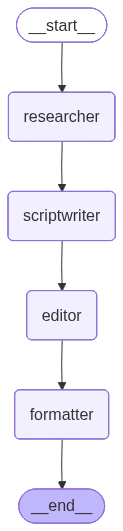
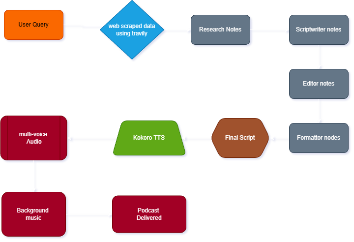

# AI Podcast Generator

This project turns a simple topic into a full AI-generated podcast.

You give it a topic, the system researches it using real-time web search, writes a script, improves the script, formats it for multi-speaker delivery, converts it into audio with Kokoro TTS, adds optional background music, and gives you a final podcast file.

## What This Project Does

In simple words, this project works like a small podcast production team:

- `Researcher` finds fresh information from the web using `Tavily`
- `Scriptwriter` turns the research into a podcast script
- `Editor` improves the script so it sounds smoother and more engaging
- `Formatter` prepares the final multi-speaker script
- `Kokoro TTS` converts the script into spoken audio
- `Background music` is added at the end
- The final podcast is saved and delivered

## Which LangGraph Agent Is Used?

This project uses a `LangGraph StateGraph` workflow.

It is a simple linear agent pipeline, not a complex supervisor-style multi-agent system.

The LangGraph nodes are:

- `researcher`
- `scriptwriter`
- `editor`
- `formatter`

Flow inside LangGraph:

`START -> researcher -> scriptwriter -> editor -> formatter -> END`

After the LangGraph part finishes, the final script moves into the audio pipeline:

`final_script -> Kokoro TTS -> multi-voice audio -> background music -> final podcast`

## Simple Flow

Here is the full flow in a very human way:

`user_topic -> web scraped data using Tavily -> research notes -> scriptwriter -> editor -> formatter -> final_script -> Kokoro -> multi_voice audio -> background_music -> podcast delivered`

### Step-by-step explanation

1. The user enters a topic.
2. Tavily searches the web to collect fresh, real-time information.
3. The `researcher` node turns those search results into useful research notes.
4. The `scriptwriter` node creates a full podcast-style script.
5. The `editor` node improves the pacing, clarity, and engagement.
6. The `formatter` node converts the script into a clean recording-ready script with speaker labels.
7. The final script is sent to `Kokoro TTS`.
8. Kokoro creates audio for each speaker using different voices.
9. The audio clips are merged into one multi-voice podcast.
10. Optional background music is added.
11. The final podcast is saved in the `outputs/` folder.

## Where To Place The Diagram

Place the workflow diagram right after the `Simple Flow` section in this README.

Use the existing image like this:


## Agent Workflow Diagram




## Project flow 



## Project Flow Explanation

This project is designed to feel simple from the user side.

The user only gives a topic, but behind the scenes the system does the work of a small podcast team. First it gathers fresh information from the internet, then it organizes that information into research notes, writes a script, cleans it up, and prepares it for recording. After that, Kokoro TTS gives voices to the speakers, the audio is combined, music can be added, and the finished podcast is delivered.

So instead of manually researching, writing, recording, and editing, this project automates the whole flow in one pipeline.

## Tech Stack

- `LangGraph` for the agent workflow
- `Tavily` for real-time web search
- `Gemini` or `OpenRouter` for LLM responses
- `Kokoro TTS` for speech generation
- `FastAPI` for API routes
- `Streamlit` for the user interface
- `pydub`, `soundfile`, and `librosa` for audio processing

## Project Structure

```text
podcast_generation/
|-- app/
|   |-- apis/                # FastAPI routes and request models
|   |-- graphs/              # LangGraph workflow, state, and nodes
|   |-- llms/                # Gemini, OpenRouter, Kokoro TTS
|   |-- tool/                # Tavily search and podcast generator
|   `-- utils/               # Parsing, voices, music, helpers
|-- assets/                  # Background music and assets
|-- outputs/                 # Final generated podcasts
|-- Agent_workflow.png       # Workflow image
|-- app.py                   # Starts FastAPI + Streamlit
|-- streamlit_ui.py          # Frontend UI
|-- requirements.txt
`-- README.md
```

## Setup

Install dependencies:

```bash
pip install -r requirements.txt
```

Create a `.env` file with:

```env
GEMINI_API_KEY=your_key_here
OPENROUTER_API_KEY=your_key_here
TRAVILY_API_KEY=your_key_here
```

## Run The Project

Start the full app:

```bash
python app.py
```

This runs:

- `FastAPI` on port `8000`
- `Streamlit` on port `7860`

## API Endpoint

Main endpoint:

```text
POST /api/v1/gen_podcast
```

Input:

- `topic`
- `u_model_inp`
- `audio_file` (optional)

## Output

After generation, the final podcast audio is saved in:

```text
outputs/
```

## Final Note

This project is best understood as an AI podcast production pipeline.

You bring the topic.  
The system does the research, writing, editing, formatting, voice generation, audio merging, music mixing, and final delivery.
